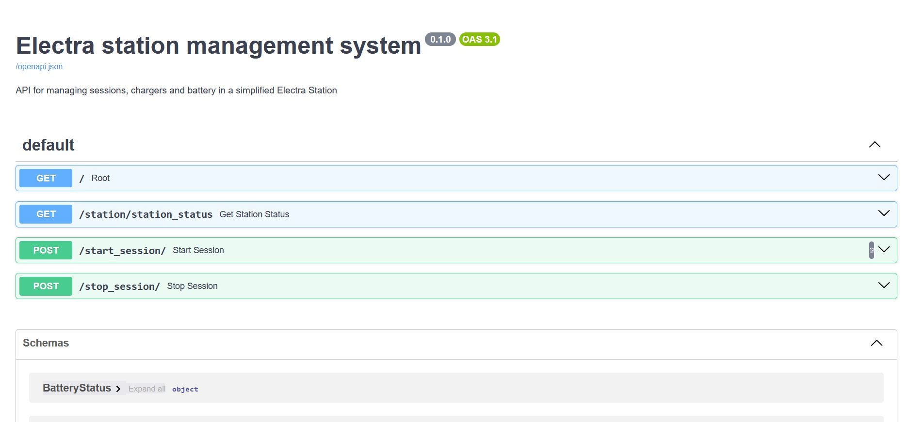

# Station Energy Management System - Electra

The goal of this project is to modelize an energy management system for a simplified Electra Station.

Explore the API endpoints using Swagger UI:



## Setup
The project is a simple FAST API app in python, that can be run locally by manually installing the packages.
In order to manage python dependencies, I used Poetry.  
You can run the application either natively or using the provided Dockerfile.  

### Local setup
In order to run natively : 

To launch Poetry and install dependencies : 
- install Poetry with the following bash command : 
```bash
(Invoke-WebRequest -Uri https://install.python-poetry.org -UseBasicParsing).Content | python -
poetry install --no-root
```
(You may need to add poetry to add Poetry to the Path of your machine on Windows to run poetry commands.)

To run the app, go into the root folder of the project and run : 
```bash
poetry run fastapi dev main.py
```

### Docker setup

```bash
docker build -t station-energy-management-system .
docker run --rm -it -p 8000:8000 station-energy-management-system
```

You can then go to http://localhost:8000/docs to see the Swagger UI of the service and play with 
the endpoints

### Unit tests 

To run the unit tests , you can run: 
```bash 
poetry install
poetry run pytest
```

## Project structure
The project is organized with the following structure : 
-  src : contains the source code of the station
    -----> station_components : contains the main components mentioned in the test, each as a python class: 
    ----->             - grid.py
    ----->             - station.py
    ----->             - charger.py 
    ----->             - battery.py
    ----->             - session.py
    ----->             - session_boost.py
    -----> folder statuses_models : contains classes inheriting Pydantic BaseModel for automatic data validation and pretty printing in the UI

- a folder  "tests" contain unit tests : you can run them with "poetry run pytest". It contains test mainly about the charger and station components

- main.py : this is the entry point of the app, which exposes simple HTTP endpoints:
          - /station/station_status : print the status of the station (active sessions, chargers, session boosts by the battery if any)
          - /start_session/ : launch a new session on a charger, imitating the arrival of an electric car 
          - /stop_session/ : stop a session, imitating the departure of an electric car from the station
          - as well a middleware is added to display the execution time of each request, and ensure it takes < 1 s

- a file station_config.json is used to easily test different configurations. It uses the same structure as the config mentioned on the Notion page. !!! You need to remove the comment from the JSON file for the code to run !!!


## Assumptions & Simplifications
For simplification, the hypothesises made here are : 
- The system is initialized with all sessions inactive and the battery's state of charge is initalized at 0
- The system varies only when new events are made, which are modelized by HTTP requests here. There is no "spontaneous" change in the state of the station
- The power discharged to the vehicles does not vary between two HTTP calls
- The power demanded by a vehicle does not vary from its arrival to its end
- At this point there is no handling of a failure of the system (for example if it goes above the power capacity threshold)

## Load-balancing strategy
Strategy to load balance the sessions: 
 - WHEN OPENING A SESSION
 The station is first consulted when a new session is requested. The total demand (based on the max power of all the sessions) is evaluated against the grid capacity of the station. 
 From there , 2 possibilities :
     (1) The total demand from the vehicles until now has exceeded the grid capacity. In these cases, the station decides which power to allocate to every session. 
     From there : 
        a. either there is a battery mechanism and the battery has a state of charge >= 20 % (threshold is hardcoded at the moment) and the session can be totally handled by the battery. In this case, the session is considered a "boost" session. It won't need energy flowing from the grid and energy will wholely come from the battery, as no hybrid session has been considered for simplicity.
        b. If there is no battery, the station decides by uniformizing the power along all the sessions of all the charger for fairness
     (2) If the total requested capacity is inferior to the grid capacity, then it is the relevant charger which decides how much power can be granted, base on its capacity and active sessions
     (either uniformization, or granting everything)
 - WHEN CLOSING A SESSION
     Here again, the state of the whole station after the closing of the session is evaluated.
     (1) if the remaining sessions represent a demand that still exceeds the grid capacity, a new uniformisation is realized
     (2) else, each charger reallocate optimally the power along the connectors
     The boosted session are not considered for the reallocation as they are handled by the battery only, and not from the grid.
- AT THE END OF EACH EVENT : if the free power of the station is superior to a threshold (50% by default, hardcoded at the moment), charge the battery by incrementing its state of charge by 10 %

## Testing scenarios
To test the scenarios, you can modify the config file to align with the scenario, and use the start_session/stop_session endpoints POST endpoints.
Between each call, you can use the GET /station/station_status endpoint to evaluate if the state of the station is as expected.

## Possible improvements.
- Some simplifications have been made and could be reconsidered for more realism.
  1) the charging curves if the vehicles has not been considered.
  For more realism, an evolution of the power demanded by the vehicle on a session could be added
  in the system
  2) The sessions cannot be hybrid. Either the power is allocated by the battery, or by the grid. As a result, even though battery could allocate for a part of the demand, it the current system, it is not considered, which results in a power that is not at the maximum possible. An improvement would be to allow this hybrid behavior
  3) At the moment the state of the system only varies when a HTTP call is made, which is a simplification of a real station. For more realism, I would add a spontaneous evolution of the system, even if there is no http call.
  4) When a new session is open or a session is closed, intermediary computations are made, which could be at a given moment incoherent, or even exceeds the grid capacity. For more realism, it would be nice to have a component make all the new computations, and apply them all at once at the end of the call.
- Code could be cleaned by adding interfaces and type hints. As well, more unit tests can be added.


